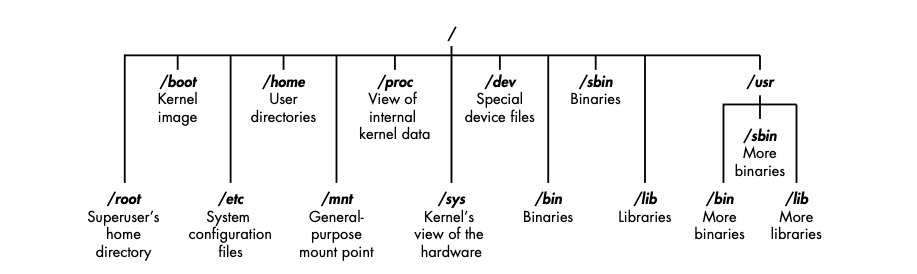

# Linux Repository

I shared a lot of information on using Linux throughout my repositories. So much so that I felt it's just neccesary just to create it's own repo.

This is not designed as an introduction to Linux, this assumes you have knowledge of computers and understand the general concept of operating systems.

## Linux Filesystem

The root (/) of the filesystem is at the top of the tree, and the following are the most important subdirectories to know:

* __/root__ The home directory of the all-powerful root user
* __/etc__ generally contains the Linux configuration files - files that control when and how programs start up
* __/home__ the user's home directory
* __/mnt__ where other filesystems are attached or mounted to the filesystem
* __/media__ where CDs and USB devices are usually attached or mounted to the filesystem
* __/bin__ where application _binaries_ (equivalent of executables in Windows) reside
* __/lib__ Where you'll find _libraries_ (shared programs that are similar to Windows DLL)

Understanding the filesystems of Linux will open the doors needed to master the _Command Line Interface_ (CLI).

Don't login as _root_ to perform routine tasks. Even hackers get hacked, and if the perpetrator has access to _root_, then your system has been _owned_.

## Table of Contents

* [The Basics](./BASICS/README.md)

